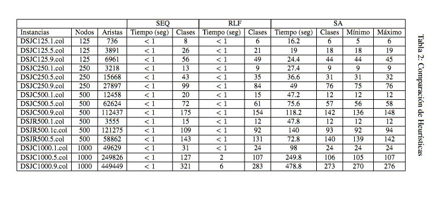

# Graph_Coloring_Problem

## Description
 SEQ, RLF and Simulated Annealing implementations in C to solve the Graph Coloring Problem. 
 
 The Graph Coloring Problem is all about assigning a color to each node in a graph, fulfilling the condition that no 2 nodes which have an edge between them have the same color, and making use of as few colors as possible. It is an np hard problem, and therefore heuristic methods are applied to solve it. There are many applications for it, like exam scheduling, air traffic management, or network frequency assignment. In this project, 3 following algorithms were implemented to solve the problem:
 
 SEQ: Acommodates node by node in classes. First, it checks (existing) class by class, whether it is possible to acommodate the node (when there is no adjacency to any node within the class), if it finds a suitable class, the node is acommodated, if this is not the case, it creates a new class for the node to be. 
 
 RLF: Creates class by class. Keeps track of a "players" node list, initially, all are in. It calculates the degree (amount of edges) of each playing node to all other players and picks the one with the largest degree to be added to the class (Isolating very connected nodes). All initially playing nodes which are adjacent to the new node in the class are passed to a new list of no longer playing nodes for the class. Subsequent steps involve, calculating the degree of remaining playing nodes, this time with respect to no longer playing ones, the one with the largest degree is added to the class (maximize the isolation of problematic edges to nodes are certain not to pertain to the class), and its playing adjacent nodes are passed to the list of no longer playing nodes, this process is repeated until no more nodes are playing, and the whole process is repeated to build subsequent classes, playing nodes at the beginning of every iteration are ones which are not yet assigned to any class. 
 
 SA: Fixes an initial number of classes and assigns nodes randomly to them. It calculates a cost function with the spirit: the larger the classes the lower the cost, favouring larger classes, and the more edges, the larger the cost, favouring isolation of edges between nodes in a class. It starts a process where a temperature value is stated, a number of iterations per temperature value are run, at the end of a cycle, temprature is reduced. At each iteration, a random existing class is picked, and a random node within it, then, a different random class, or a new one, is picked, the movement of the node from its current class to the randomly picked one is evaluated in terms of the cost function, a better solution in this terms is always visited, a worse solution is accepted given a probability, which is reduced as temperature lowers. 

 ## Technologies used 
 -This project was developed in C language, since the Bachelor Thesis supervisor wanted us to understand the algorithms at the low programming level and wanted to leverage the efficency of C. 

 ## Results

 

From Spanish translations:
Instancias = Instances 
Nodos = Nodes
Aristas = Edges
Tiempo (seg) = Time (seconds)
Clases = Classes
Mínimo = Minimum 
Máximo = Maximum

A clear better performance in terms of time is displayed by the more simple SEQ and RLF algorithms, though the SA displayed reasonable running times with its largest time for a run, 479 seconds, or 8 minutes. On the other hand, a few exceptions appart, the SA algorithm outperforms its peer SEQ and RLF algorithms in number of resulting classes created.
 
